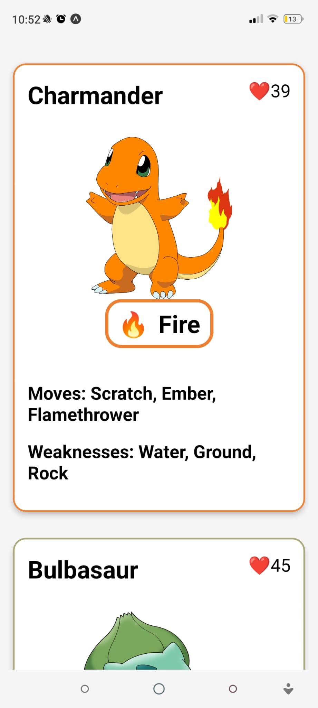
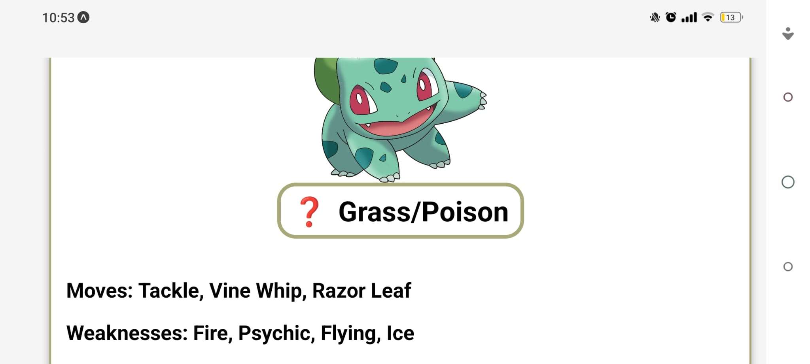
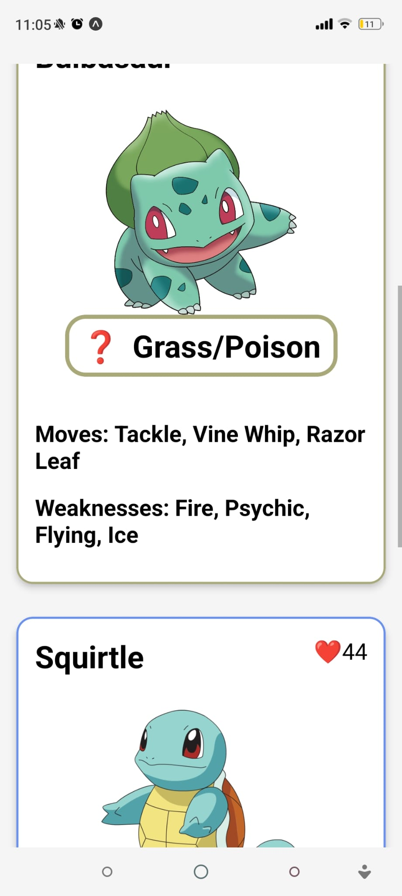
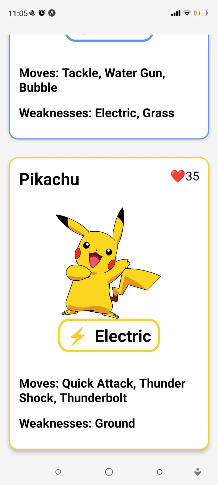

# 🃏 Pokemon Cards – React Native

A simple React Native app that displays scrollable Pokémon cards with dynamic styling.

## 📱 Features

- Scrollable card list (`ScrollView`)
- Reusable `PokemonCard` component
- Dynamic border color & emoji based on type
- Pokémon image, HP ❤️, moves, and weaknesses
- Cross-platform styling (iOS shadows / Android elevation)
- Safe area support

## 🛠 Tech Stack

- React Native
- TypeScript
- Expo
- react-native-safe-area-context

## 🖼 Screenshots

  
  
  

## 🙏 Credits

Based on concepts learned from this YouTube playlist:  
https://www.youtube.com/playlist?list=PLC3y8-rFHvwhiQJD1di4eRVN30WWCXkg1

## 🎯 Purpose

Practice building reusable components, dynamic styling, and structured mobile UI layouts.